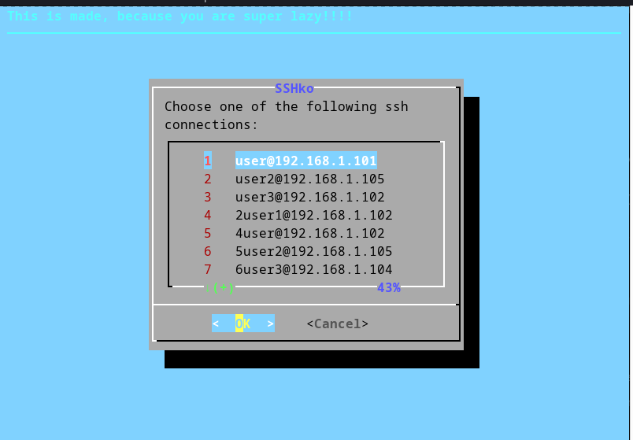
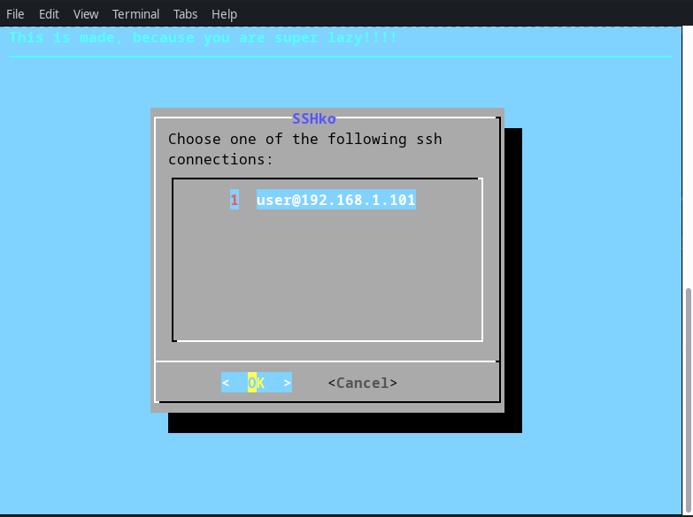

# sshko
Your are lazy and can not remember ssh connection? Then this is for you! This is a ssh connection manager. It can be easy modified. 



## Usage
* copy sshko.sh and put it where you want (I put it in user home dir ~/)
* make an alias
```
alias sshko="~/sshko.sh $@"
```
* try it:
```
sshko
```
it should output a message
```
ssh log file is empty 
```
try to use it with ssh connection (same like ssh command)
```
sshko user@192.168.1.101
```
it will save the connection and execute ssh and then ask you for password

if you try it again without argument it will show you a dialog will all ssh connections
```
sshko
```

Basically it saves every connection in ~/.sshLog.txt file


Now you don't need to remember any ssh connections, just call `sshko` and it will show you all ssh used connections.


## Requirements
* installed `ssh`

Happy sshing !!! :) 